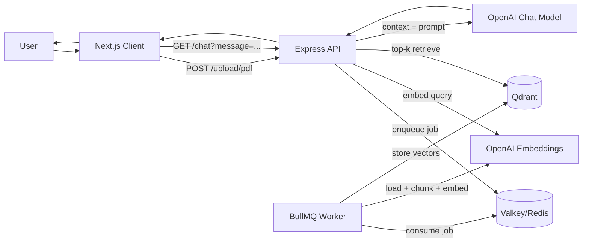

# PDF RAG Codebase

A full-stack PDF-based Retrieval-Augmented Generation (RAG) application.

This project lets users:
- upload PDF files from a Next.js UI,
- process and embed the document content in the background,
- retrieve relevant chunks from a vector database,
- ask questions and receive grounded answers from an LLM.

## Project Architecture

### High-level Flow



### Components

- **Client (Next.js 15 + React 19)**
  - UI for PDF upload and chat.
  - Uses Clerk middleware/provider to gate access to signed-in users.
- **API Server (Express)**
  - Handles PDF uploads.
  - Enqueues processing jobs in BullMQ.
  - Handles chat requests by retrieving context from Qdrant and calling OpenAI.
- **Worker (BullMQ Consumer)**
  - Loads uploaded PDF files.
  - Generates embeddings and writes document vectors to Qdrant.
- **Valkey (Redis-compatible)**
  - Job queue backend for BullMQ.
- **Qdrant**
  - Vector database storing embedded PDF chunks.

## Tech Stack

### Frontend
- Next.js 15 (App Router)
- React 19 + TypeScript
- Tailwind CSS v4
- Radix UI primitives
- Clerk (`@clerk/nextjs`) for auth

### Backend
- Node.js + Express 4
- Multer (multipart PDF upload)
- BullMQ (job queue)
- LangChain ecosystem:
  - `@langchain/openai`
  - `@langchain/qdrant`
  - `@langchain/community` (PDF loader)
- OpenAI SDK (`openai`)

### Infrastructure
- Docker Compose
- Valkey (`valkey/valkey`)
- Qdrant (`qdrant/qdrant`)

## Repository Structure

```text
.
├── docker-compose.yml
├── client/
│   ├── app/
│   │   ├── components/
│   │   │   ├── chat.tsx
│   │   │   └── file-upload.tsx
│   │   ├── layout.tsx
│   │   └── page.tsx
│   ├── middleware.ts
│   └── package.json
└── server/
    ├── index.js
    ├── worker.js
    ├── uploads/
    └── package.json
```

## Runtime Data Flow

1. User uploads a PDF in the client.
2. Client calls `POST /upload/pdf` on the server with `multipart/form-data`.
3. Server stores file in `server/uploads/` and enqueues a BullMQ job (`file-upload-queue`).
4. Worker consumes the job, loads PDF content, generates embeddings, and stores vectors in Qdrant collection `langchainjs-testing`.
5. User asks a question in chat.
6. Client calls `GET /chat?message=...`.
7. Server embeds the question, retrieves top `k=2` chunks from Qdrant, injects context into prompt, and calls OpenAI chat model.
8. Server returns answer plus retrieved docs for transparency/debugging.

## API Endpoints

### `GET /`
Health check.

Response:

```json
{ "status": "All Good!" }
```

### `POST /upload/pdf`
Uploads one PDF file.

- Content type: `multipart/form-data`
- Form field name: `pdf`

Response:

```json
{ "message": "uploaded" }
```

### `GET /chat?message=<text>`
Runs retrieval + generation for a user question.

Response shape:

```json
{
  "message": "assistant answer...",
  "docs": [
    {
      "pageContent": "retrieved chunk",
      "metadata": { "source": "...", "loc": { "pageNumber": 1 } }
    }
  ]
}
```

## Local Setup Guide

### 1. Prerequisites

Install the following:
- Node.js 20+
- pnpm (recommended)
- Docker + Docker Compose
- OpenAI API key
- Clerk project keys (for frontend auth)

### 2. Start Infrastructure (Valkey + Qdrant)

From repository root:

```bash
docker compose up -d
```

This starts:
- Valkey on `localhost:6379`
- Qdrant on `localhost:6333`

### 3. Install Dependencies

```bash
cd server && pnpm install
cd ../client && pnpm install
```

### 4. Configure Secrets / Environment

### Client (Clerk)
Create `client/.env.local` with your Clerk values:

```env
NEXT_PUBLIC_CLERK_PUBLISHABLE_KEY=your_publishable_key
CLERK_SECRET_KEY=your_secret_key
```

### Server (OpenAI)
Current code uses empty `apiKey: ''` placeholders in:
- `server/index.js`
- `server/worker.js`

Set your OpenAI key there for now, or (recommended) refactor to `process.env.OPENAI_API_KEY` and load from a `.env` file.

### 5. Run Services

Open 3 terminals:

### Terminal A: API server

```bash
cd server
pnpm dev
```

Runs on `http://localhost:8000`.

### Terminal B: Worker

```bash
cd server
pnpm dev:worker
```

Consumes file processing jobs.

### Terminal C: Frontend

```bash
cd client
pnpm dev
```

Runs on `http://localhost:3000`.

### 6. Verify End-to-End

1. Open `http://localhost:3000`.
2. Sign in/up through Clerk.
3. Upload a PDF from the left panel.
4. Ask a question in the chat panel.
5. Confirm you receive an answer and document chunks in response.

## Development Notes

- Vector collection name is hardcoded as `langchainjs-testing`.
- Retrieval count is hardcoded to top `k=2`.
- Uploaded files are stored under `server/uploads/`.
- Current chat endpoint uses query-string input (`GET /chat?message=...`).

## Troubleshooting

### Worker not processing files
- Ensure Valkey is running on `6379`.
- Ensure worker process (`pnpm dev:worker`) is running.

### No answers or empty context
- Verify Qdrant is running on `6333`.
- Check worker logs to confirm document vectors were inserted.
- Verify OpenAI API key is configured.

### Frontend auth not working
- Check Clerk keys in `client/.env.local`.
- Ensure `client/middleware.ts` is active and routes are protected as expected.

### CORS issues
- Server enables permissive CORS via `app.use(cors())`; verify requests are going to `http://localhost:8000`.

## Future Improvements

- Move all secrets and URLs to environment variables.
- Add robust PDF chunking strategy before embedding.
- Add metadata filtering and multi-document namespace/tenant support.
- Add server-side validation and error handling on upload/chat routes.
- Add tests (API, worker, and UI integration).

## License

No license file is currently present in this repository.
